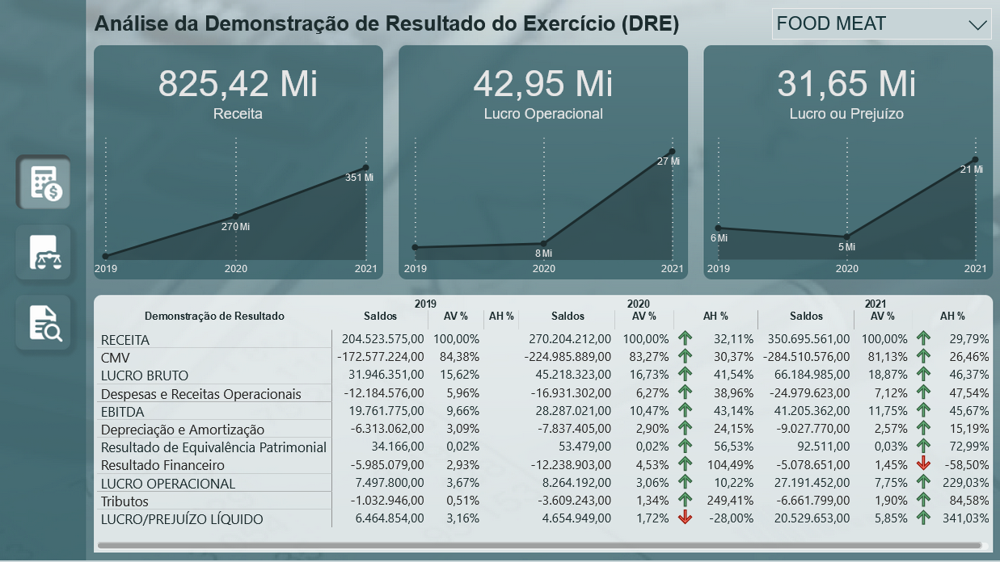
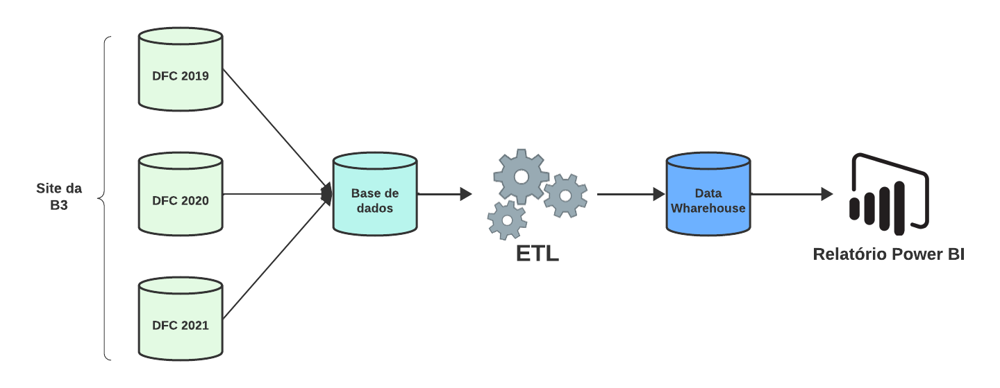

# Análise de Demosntrações Contabeis com Power BI e MS SQL Server

## Objetivo:
O projeto visa criar uma solução que permita a importação, transformação e visualização eficiente de dados contábeis por meio da integração entre o Power BI e o SQL Server. A aplicação prática dessas ferramentas será direcionada para a análise das demonstrações contábeis, com ênfase no Balanços Patrimoniais, Demonstrativos de Resultados e Indicadores.

## Sobre o conjunto de Dados:
Foram usadas as demonstrações contábeis dos exercícios de 2019 a 2021 de 5 empresas dos ramos de alimentos, bebidas, celulose, varejo e mineração, as demonstrações estão disponíveis ao público através do site da [B3.com.br](https://www.b3.com.br/pt_br/).

## Relatório:
>Clique na imagem abaixo para acessar o relatório.

## Contextualização:

A empresa acionou sua equipe de dados e contabilidade para realizar uma análise detalhada das demonstrações contábeis de cinco empresas pertencentes ao grupo. O objetivo é fornecer insights estratégicos que possam orientar a tomada de decisões dos gestores e investidores. Para atender a essa demanda, as equipes se depararam com uma série de perguntas-chave que demandam uma análise profunda das informações contidas nos Balanços Patrimoniais e Demonstrações de Resultados das empresas em questão.

- **Quais são os valores das análises verticais e horizontais nas Demonstrações de Resultados e nos Balanços Patrimoniais das empresas?**
  
Essas análises ajudarão a compreender a estrutura de custos, a rentabilidade e a evolução temporal dos elementos patrimoniais.

- **Qual é o faturamento acumulado nos últimos cinco anos analisados na Demonstração de Resultados de cada empresa?**
  
Essa informação é crucial para avaliar a performance de vendas e identificar padrões de crescimento.

- **As empresas apresentaram lucro nos anos analisados?**
  
Analisar a lucratividade é fundamental para compreender a viabilidade financeira e a capacidade das empresas de gerar retorno para os investidores.

- **Qual é o EBITDA de cada empresa para cada ano?**
  
O EBITDA fornece uma visão clara da capacidade operacional e eficiência de gestão das empresas, sendo um indicador-chave para avaliação de desempenho.

- **Qual é a Liquidez Geral e Corrente das empresas?**
  
Entender a liquidez é vital para avaliar a capacidade de pagamento das obrigações de curto prazo e a saúde financeira geral das organizações.

- **Qual é o nível de endividamento de curto prazo das empresas?**
  
Analisar o endividamento é essencial para avaliar a sustentabilidade financeira e os riscos associados à estrutura de capital das empresas.

- **Quais empresas apresentam o melhor Retorno sobre o Patrimônio Líquido (ROE) e a MArgem de Retorno sobre as Operações?**
  
Esses indicadores ajudam a avaliar a eficiência dos ativos, a rentabilidade do patrimônio líquido e a eficácia das estratégias de precificação.

## Processo de Resolução:

### Fluxo de Trabalho do Projeto:

- [X] Extração e tratamento dos dados das demonstrações.
- [X] Modelagem de tabela dos dados gerais no MS SQL Server.
- [X] Modelagem do banco de dados dimensional no MS SQL Server.
- [X] Conecção do banco de dados com o Power BI.
- [X] Desenvolvimento do relatório.
- [X] Deploy para a plataforma Power BI web e disponibilização para os gestores.

## Conclusão:
Com o a implementação deste projeto, obtivemos um sistema completo que permitirá aos gestores e analistas financeiros acessar, analisar e interpretar de maneira eficaz as demonstrações contábeis. A solução proporciona uma visão abrangente do desempenho financeiro das organizações que integram o grupo empresarial, facilitando a identificação de oportunidades, mitigação de riscos e a tomada de decisões estratégicas embasadas em dados concretos.
